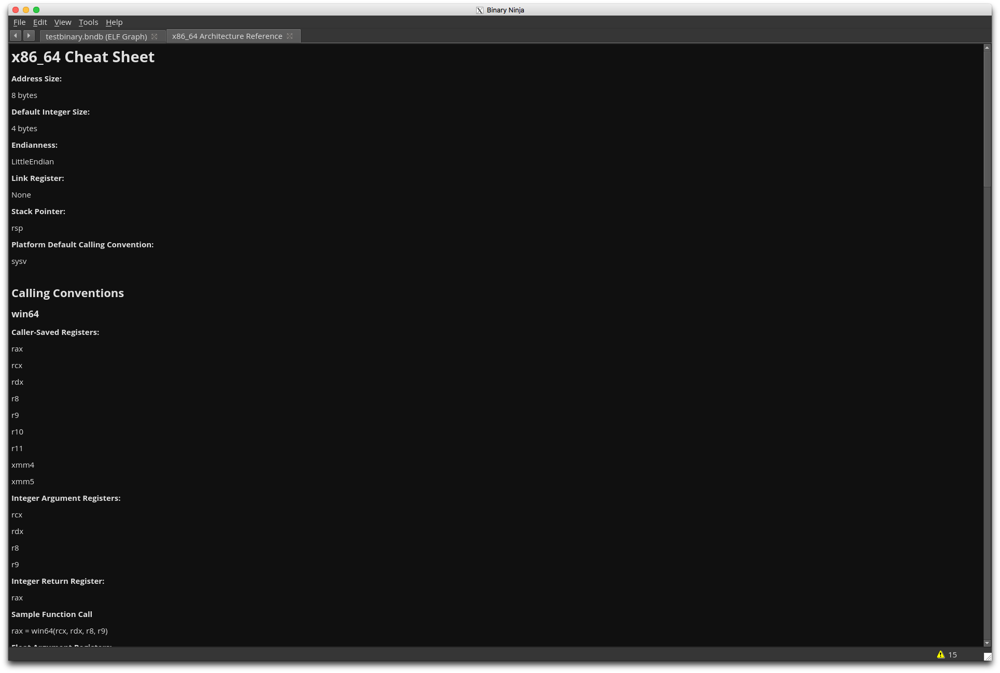

# binja_sensei
Educational tools for Binary Ninja

This plugin provides resources for beginners to learn reverse engineering using Binary Ninja. It automatically installs several other plugins, and provides examples that showcase the features of these plugins.

## Setup

#### Plugin Manager
For the sake of futureproofing, Binja Sensei installs plugins via the yet-incomplete Plugin Manager API. Since the plugin manager does not currently have a GUI, installation must be accomplished by running the following snippet at the Binary Ninja script console (Accessed via Ctrl+\`).
```python
manager = RepositoryManager()

manager.install_plugin('Sensei')
```
Next, restart Binary Ninja. When loaded, Sensei will update all the bundled plugins to the latest version, and install any python dependencies for each plugin. It *won't* automatically run install scripts, so if you're on Ubuntu and intend to set up `binja_dynamics`, you'll need to navigate to `~/binaryninja/repositories/default/plugins/binja_dynamics` and run `./install.sh`. At time of writing, you'll also need to run the snippet in the Caveats section before restarting.

#### Manual Installation
If any of the plugin installations fail, you may have more success performing a manual installation. Pending [Issue #753](https://github.com/Vector35/binaryninja-api/issues/753), some plugins that reply on absolute file paths may not work unless manually installed. To manually install, copy the relevant repository links below, and clone them inside of your [plugins directory](https://github.com/Vector35/binaryninja-api/tree/master/python/examples#loading-plugins).
```
https://github.com/carstein/Annotator.git
https://github.com/ehennenfent/binja_arch_ref.git
https://github.com/ehennenfent/binja_dynamics.git
https://github.com/ehennenfent/binja_explain_instruction.git
https://github.com/carstein/Syscaller.git
```

### Caveats
Due to a [bug](https://github.com/Vector35/binaryninja-api/issues/740) (as of dev-1.0.794) in the way Binary Ninja handles repository management, all the plugins installed by Binja Sensei (via the plugin manager) will be disabled. To fix this, after first installing Sensei, simply run the following snippet in the script console, then restart Binja.
``` python
manager = RepositoryManager()

for plugin in manager.plugins['default']:
  log_info(plugin.name + ": " + str(manager.enable_plugin(plugin, install=False)))
```

## Bundled Tools
Please note that the bundled tools remain property of their respective authors. While this plugin is offered under an [MIT License](LICENSE), that license does not extend to any of the plugins below.
* [**Annotator**](#annotator) by Carstein
* [**Architecture Reference**](#architecture-reference)
* [**Binja Dynamic Analysis Tools**](#binja-dynamic-analysis-tools)
* [**Explain Instruction**](#explain-instruction)
* [**Syscaller**](#syscaller) by Carstein

## Writeups
To demonstrate potential use cases for these plugins, solutions for the five overflow challenges from [PicoCTF 2013](https://github.com/picoCTF/2013-Problems) are included.

* [Overflow 1](writeups/overflow1/writeup.md)
* [Overflow 2](writeups/overflow2/writeup.md)
* [Overflow 3](writeups/overflow3/writeup.md)
* [Overflow 4](writeups/overflow4/writeup.md)
* [Overflow 5](writeups/overflow5/writeup.md)

## Examples

### [Annotator](https://github.com/carstein/Annotator/)
Annotator uses a virtual stack to annotate calls to libc functions with argument prototypes.


### [Architecture Reference](https://github.com/ehennenfent/binja_arch_ref)
This plugin displays a cheat sheet with Binary Ninja's internal information on the architecture.


### [Binja Dynamic Analysis Tools](https://github.com/ehennenfent/binja_dynamics)
This plugin adds a Qt frontend to [Binjatron](https://github.com/snare/binjatron), including highlights intended to help beginners spot important memory locations.


### [Explain Instruction](https://github.com/ehennenfent/binja_explain_instruction/)
Adds a popup window that explains in simple English what an assembly instruction does.


### [Syscaller](https://github.com/carstein/Syscaller)
Annotates system calls with arguments.

