## Showcase
Consider the following C snippet:

```c
void shell(void) {
    execl("/bin/sh", "sh", NULL);
}

void vuln(char *str) {
    char buffer[32];
    // Doesn't check whether str is less than 32 bytes long
    strcpy(buffer, str);
}

int main(int argc, char **argv){
    char vulnerable_buffer[64];
    memset(vulnerable_buffer, 0, 64);

    // read up to 64 bytes from stdin
    read(0, vulnerable_buffer, 64);
    vuln(vulnerable_buffer);

    return 0;
}
```

There are two important things to notice about this snippet:
* It exhibits a buffer overflow vulnerability. The buffer in the `vuln` function can only hold 32 bytes, but the `main` function may pass it as many as 64 bytes. When `strcpy` is called in the `vuln` function, it may overwrite the contents of the stack.
* The function `shell` executes `/bin/sh`, but it is never called.

As an attacker, I want to craft an exploit that tricks this program into executing the `shell` function so I can take control of the computer running it. Let's look at how I can use the tools created for this project to develop such an exploit.


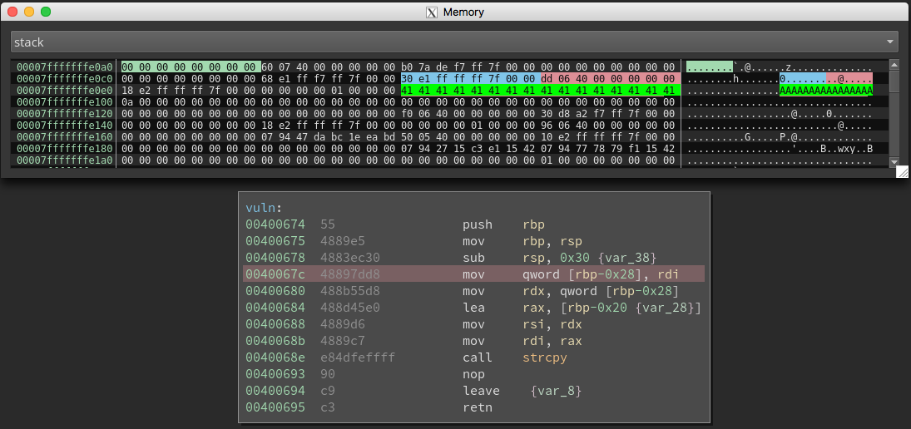


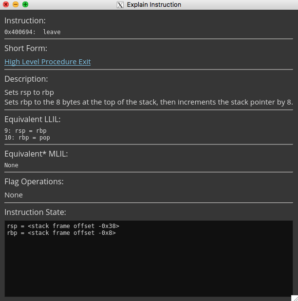


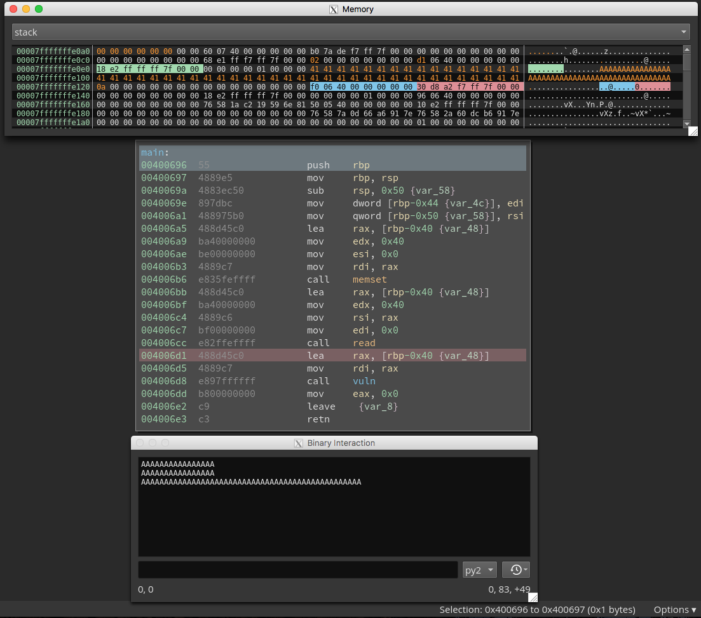


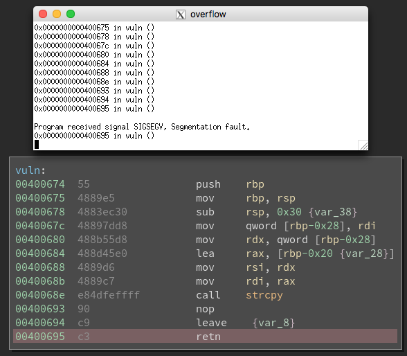


```python
import struct

buffer_length = 32
saved_rbp_width = 8

desired_return_address = 0x400654
packed_return_address = struct.pack('<I', desired_return_address)


print 'A'*(buffer_length + saved_rbp_width) + packed_return_address

```

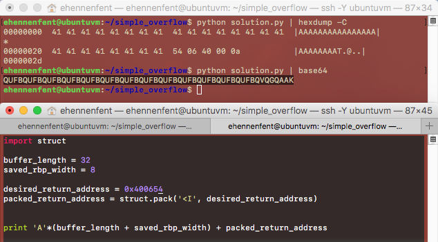


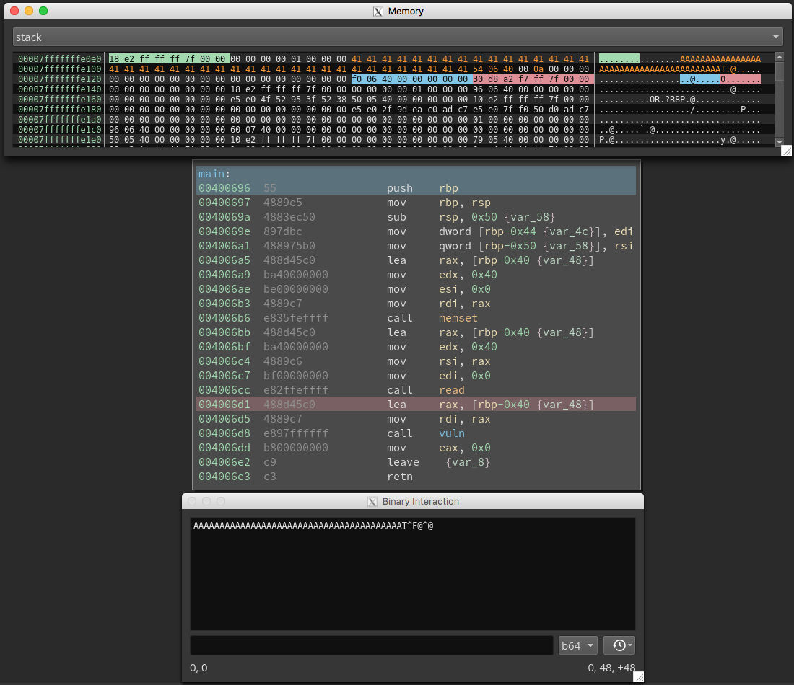

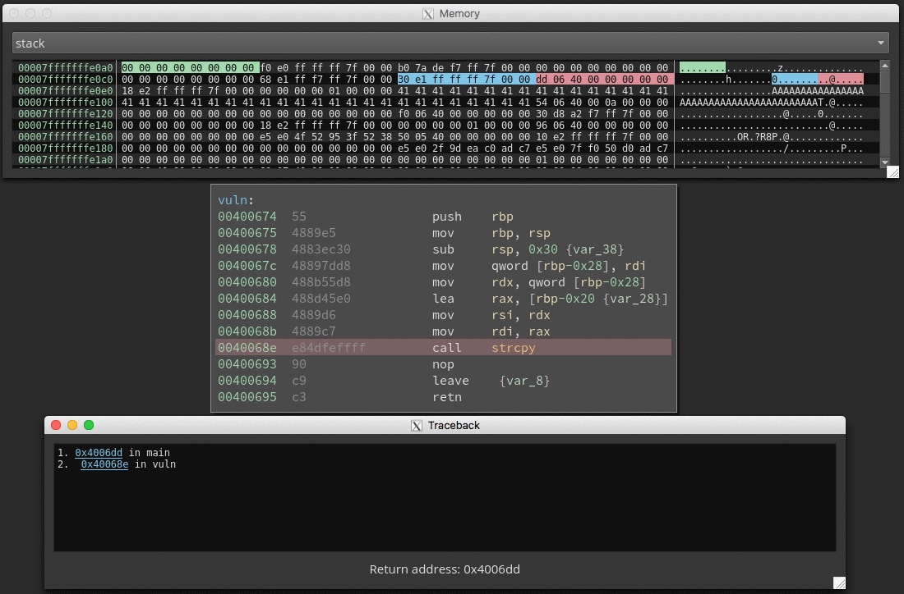

Next, I'll step through the `leave` and `retn` instructions. Since I successfully overwrote the return address with the address of `shell`, the instruction pointer now points to the first instruction there. As you can see in the traceback viewer, overwriting the saved base pointer did some horrible things to the stack. Fortunately, I don't need to be concerned about this, since I only care whether `shell` drops a shell as expected, not whether it exits without throwing a segmentation fault.

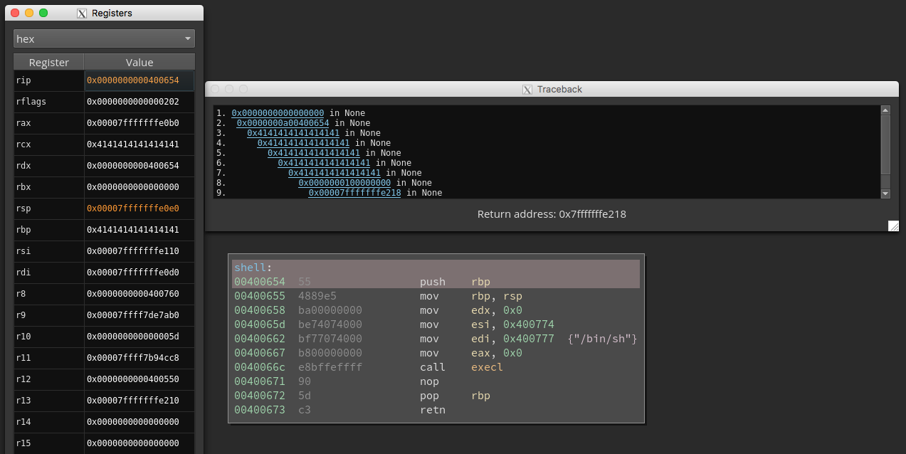

Before I go any further, I need to delete the breakpoints set in GDB. If I don't do this, the exploit will still work, but GDB will attempt to set breakpoints in `/bin/sh` after we execute it, which will cause problems because `/bin/sh` has a different address layout than the current binary.

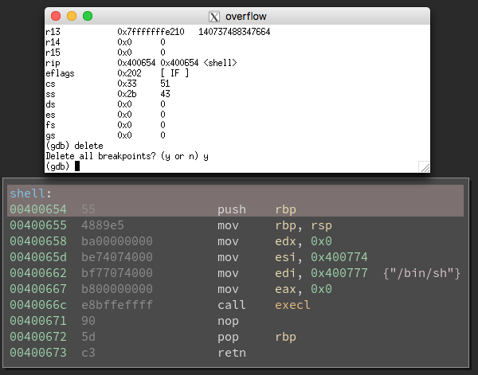

Since I deleted the breakpoints at the GDB console instead of via the Binja UI, binjatron will complain that the existing breakpoints have suddenly disappeared. I'll click "No" at the prompt so that it doesn't undo what I just did.


Next, I'll click the "Continue" button, which will tell GDB to continue executing until it hits another breakpoint (all of which we just deleted). The shell function executes `/bin/sh`, and a prompt appears in the interaction console.

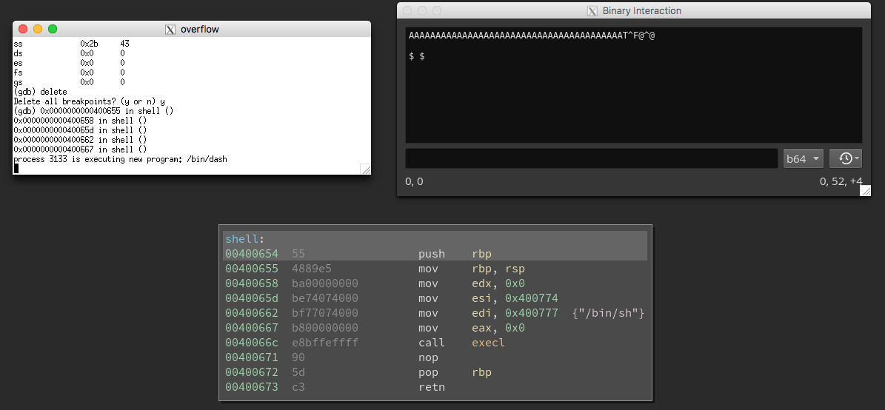

Just to prove that everything works, I'll run the `whoami` command at the console, which prints out my username.

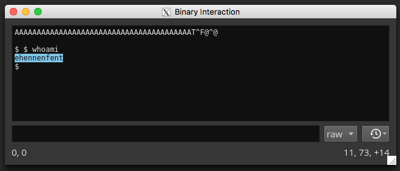

Exploiting a program in GDB is one thing, but I want to double check that my exploit works in an actual environment. I'll pipe the output of the python solution into `pbcopy` to put it on my clipboard, verify that it worked as expected by piping `pbpaste` into a hexdump, then run the program and paste in the exploit. Just as in GDB, the exploit gets us a shell. Note that my VM has ASLR turned off so that the address space in bash will match the address space in GDB.

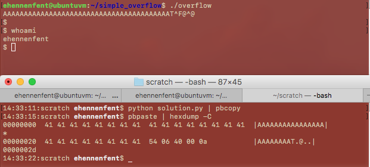

### Further Reading
This writeup focused on showcasing how the tools bundled with this plugin can aid a beginner in exploiting a program via a buffer overflow, not on how buffer overflows work. For more information on buffer overflows, consider reading the seminal work on the subject: [Smashing the Stack for Fun and Profit](https://www.eecs.umich.edu/courses/eecs588/static/stack_smashing.pdf).
